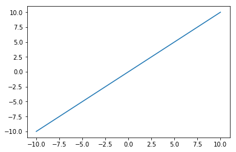
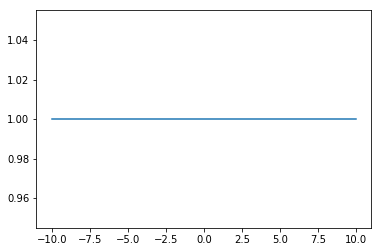
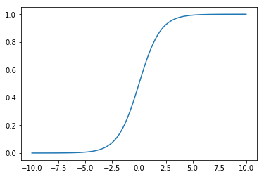
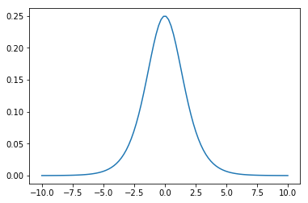
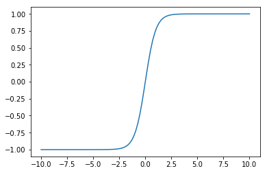
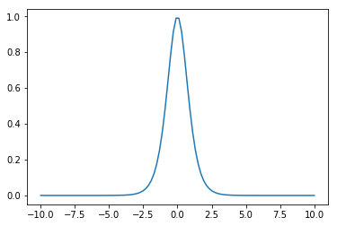
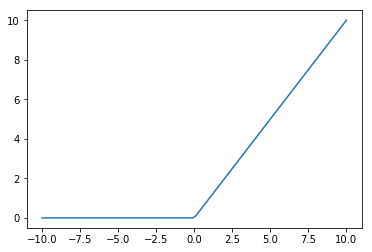
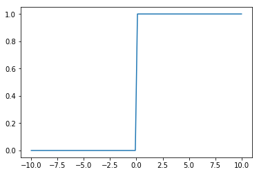
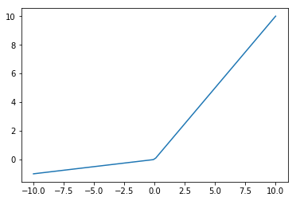
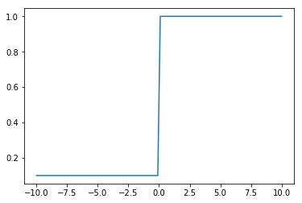

# Activation Function

In a neural network, activation function of a node defines the output of that node given input or set of input. It also makes sense of something complicated and non-linear complex mapping between the input and the output.


```python
import numpy as np
import matplotlib.pyplot as plt
```

If function is linear and passed thro


```python
def linear(x):
    return(x)

sample_z = np.linspace(-10,10,100)
sample_a = linear(sample_z)

plt.plot(sample_z,sample_a);
```





```python
def d_linear(x):
    return([1 for x in x])

sample_z = np.linspace(-10,10,100)
sample_a = d_linear(sample_z)

plt.plot(sample_z,sample_a);
```





```python
def sigmoid(x):
    return( 1 / (np.exp(-x) + 1))

sample_z = np.linspace(-10,10,100)
sample_a = sigmoid(sample_z)

plt.plot(sample_z,sample_a);
```





```python
def d_sigmoid(x):
    return(sigmoid(x)*(1 - sigmoid(x)))

sample_z = np.linspace(-10,10,100)
sample_a = d_sigmoid(sample_z)

plt.plot(sample_z,sample_a);
```





```python
def tanh(x):
    return((2/(1+np.exp(-2*x)))-1)

sample_z = np.linspace(-10,10,100)
sample_a = tanh(sample_z)

plt.plot(sample_z,sample_a);
```





```python
def d_tanh(x):
    return(1-(tanh(x)**2))

sample_z = np.linspace(-10,10,100)
sample_a = d_tanh(sample_z)

plt.plot(sample_z,sample_a);
```





In a function like sigmoid and tanh, when the value of z becomes very large, activation function value become very small and slow down gradient descent thus making it hard to converge.


```python
def relu(x):
    return(np.maximum(0,x))

sample_z = np.linspace(-10,10,100)
sample_a = relu(sample_z)

plt.plot(sample_z,sample_a);
```





```python
def d_relu(x):
    return([0 if x<0 else 1 for x in x])

sample_z = np.linspace(-10,10,100)
sample_a = d_relu(sample_z)

plt.plot(sample_z,sample_a);
```





```python
def Leakyrelu(x, alpha = 0.1):
    return(np.maximum(alpha*x,x))

sample_z = np.linspace(-10,10,100)
sample_a = Leakyrelu(sample_z)

plt.plot(sample_z,sample_a);
```





```python
def d_Leakyrelu(x,alpha=0.1):
    return([alpha if x<=0 else 1 for x in x])

sample_z = np.linspace(-10,10,100)
sample_a = d_Leakyrelu(sample_z)

plt.plot(sample_z,sample_a);
```





Leaky relu is one attempt to fix the 'dying ReLu' problem. Instead of the function will instead have a small negative slope. One thing to note that alpha can be treated as hyperparameter.
